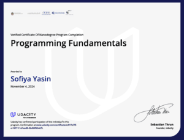
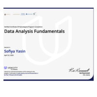
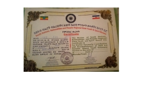
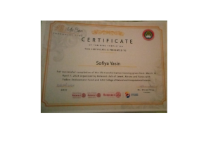

<h1 align="center">Hi there, I'm Sofiya Yasin 👋</h1>

  <em>Computer Science Student &middot; Junior Full Stack Developer</em>  

<b>“Nothing is impossible!”</b>

---

### 👩‍💻 About Me

- 💡 Computer Science Student passionate about learning and building impactful solutions.
- 💻 Junior Full Stack Developer with hands-on experience in both frontend and backend technologies.
- 🎨 Aspiring Designer skilled in Adobe Photoshop & Illustrator.
- 🌍 Always exploring new tech, solving problems, and leveling up my skills!

---

### 🚀 Top Skills & Technologies

---

### 🌟 Featured Project

#### [Yebragi Psychotherapy Web Platform](https://github.com/Sofi3406/yebragi-psychotherapics_web_platform)
A web platform connecting patients and therapists:
- 📅 Book appointments easily
- 💳 Secure payments (Chapa integration)
- 📹 Automated Google Meet session links
- 🧠 Curated mental health resources
- 🗄 Detailed backend architecture: REST & GraphQL APIs, third-party integrations, background processing, developer workflows

---

### 📚 Other Notable Projects

- [Nexus DSA Tutorials](https://github.com/Sofi3406/nexus_tutorial_dsa): Educational resources and tutorials for Data Structures & Algorithms.
- [MyFitnessPall](https://github.com/Sofi3406/my_fitnesspall): Personal fitness tracking and wellness app.

---

  

### 📜 Certificates

- Programming Fundamentals (Udacity, Nov 2024)  
  

- Data Analysis Fundamentals (Udacity, Apr 2025)  
  

- Certificate of Practice (Regional Youth & Sports Bureau)  
  

- My Bean Innovation Hub Training  
  

---

### 🌐 Connect with Me

- [LinkedIn](https://www.linkedin.com/in/sofiya-yasin-181345355)
- [Telegram](https://t.me/wisdom0746)
- [Portfolio/Website](https://sofiyayasinwebdeveloperandgraphicdesi.netlify.app/)
- [TikTok](https://www.tiktok.com/@sofiya.yasin357)

---

### 🎉 Fun Facts About Me

- 🌱 I love learning new frameworks and design tools—every project is a new adventure!
- ☕️ My best code is written with a cup of Ethiopian coffee in hand.
- 🎵 Coding playlists and lo-fi beats are my secret productivity hack.
- 🧩 I enjoy solving puzzles and brain teasers—both in code and for fun.
- 🦸 I believe in using tech for good: empowering people, supporting mental health, and building inclusive communities.

---
